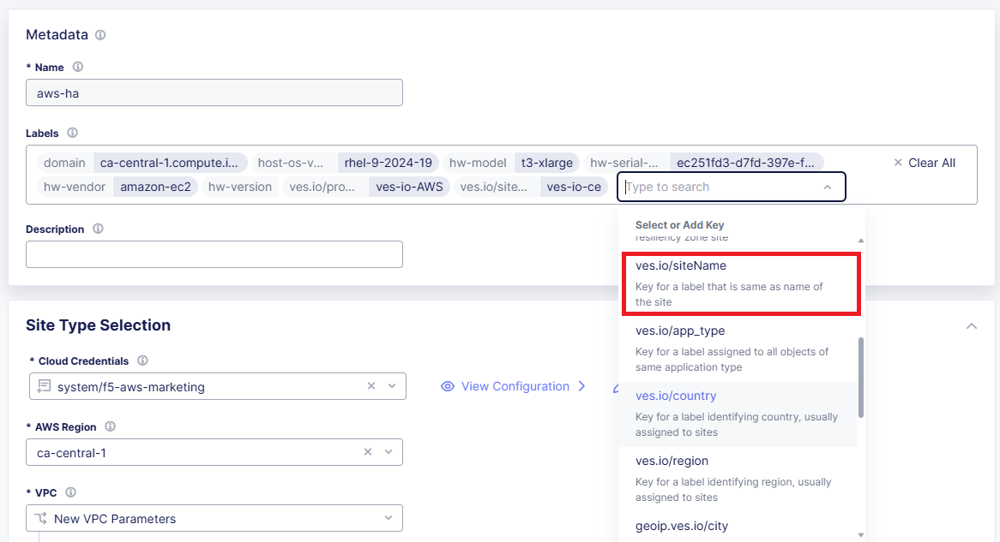
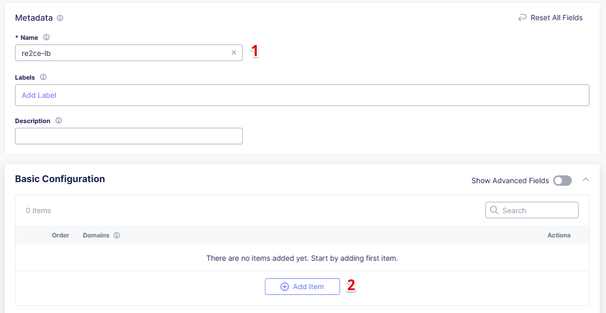
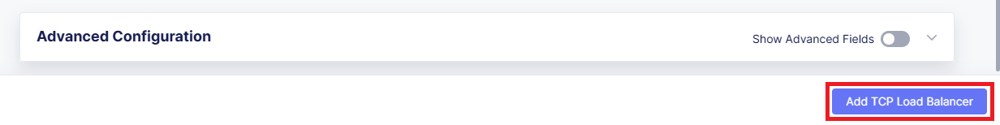

# F5 Enterprise Networking with High-Availability Config (on Amazon AWS)

## Table of Contents

- [F5 Enterprise Networking with High-Availability Config (on Amazon AWS)](#f5-enterprise-networking-with-high-availability-config-on-amazon-aws)
  - [Table of Contents](#table-of-contents)
  - [Objective](#objective)
  - [Resources](#resources)
  - [Pre-requisites](#pre-requisites)
  - [Deployment architecture](#deployment-architecture)
  - [Step 1: Prepare environment for HA Load](#step-1-prepare-environment-for-ha-load)
    - [Creating an AWS VPC site](#creating-an-aws-vpc-site)
    - [Attaching a label](#attaching-a-label)
    - [Creating Virtual Site](#creating-virtual-site)
    - [Creating VK8S cluster](#creating-vk8s-cluster)
  - [Step 2: Deploy HA PostgreSQL to CE](#step-2-deploy-ha-postgresql-to-ce)
    - [HA PostgreSQL Architecture in vK8s](#ha-postgresql-architecture-in-vk8s)
    - [Downloading Key](#downloading-key)
    - [Adding Bitnami Helm Chart repository to Helm](#adding-bitnami-helm-chart-repository-to-helm)
    - [Updating credentials in Makefile](#updating-credentials-in-makefile)
    - [Making Secrets](#making-secrets)
    - [Updating DB Deployment Chart Values](#updating-db-deployment-chart-values)
    - [Deploying HA PostgreSQL chart to the Distributed Cloud Platform vK8s](#deploying-ha-postgresql-chart-to-the-distributed-cloud-platform-vk8s)
    - [Checking deployment](#checking-deployment)
  - [Step 3: Expose CE services to RE deployment](#step-3-expose-ce-services-to-re-deployment)
    - [Exposing CE services](#exposing-ce-services)
    - [Creating origin pool](#creating-origin-pool)
    - [Creating TCP Load Balancer](#creating-tcp-load-balancer)
    - [Advertising Load Balancer on RE](#advertising-load-balancer-on-re)
  - [Step 4: Test connection from RE to DB](#step-4-test-connection-from-re-to-db)
    - [Infrastructure to Test the deployed PostgreSQL](#infrastructure-to-test-the-deployed-postgresql)
    - [Build Docker](#build-docker)
    - [NGINX Reverse Proxy Config to Query PostgreSQL DB](#nginx-reverse-proxy-config-to-query-postgresql-db)
    - [Deploying NGINX Reverse Proxy](#deploying-nginx-reverse-proxy)
    - [Reviewing the NGINX Deployment](#reviewing-the-nginx-deployment)
    - [Creating HTTP Load Balancer (App Connect)](#creating-http-load-balancer-app-connect)
    - [Testing: Request data from PostgreSQL DB](#testing-request-data-from-postgresql-db)
  - [Wrap-Up](#wrap-up)

## Objective

Use this guide to explore an AWS-specific example of High-Availability (HA) Application Delivery using F5 Distributed Cloud Services (XC). This guide walks through a sample configuration of **F5 Enterprise Networking** (F5 Distributed Cloud Network Connect) and **F5 Load Balancing** (F5 Distributed Cloud App Connect). Leveraging distributed architecture like this simplifies deploying and managing workloads across multiple clouds and regions.

This guide will help you become familiar with the general pattern of deploying high-availability configurations using Kubernetes Helm charts in a multi-node site, which can then be exposed to other services. This is a common use case leveraging F5 Distributed Cloud Customer Edge (CE) for deploying a backend or a database, which can then be used in conjunction with Regional Edge (RE) deployments that consume and interact with the central CE location. In this guide, we use an example of a PostgreSQL database deployment in a High-Availability (HA) configuration on a CE and expose it to RE location(s) closer to end users for lower latency, improved performance, and data resiliency.

The guide includes the following key steps:

- Preparing the environment for HA workload
- Deploying HA PostgreSQL database to CE
- Exposing CE services to RE deployment
- Testing the connection from RE to DB

The resulting architecture will be a PostgreSQL database deployed in an HA configuration on Kubernetes running on several compute nodes within an AWS VPC and exposed via a TCP Load Balancer to a service in an RE that reads and presents the database contents to end users, which is a perfect fit for a CE deployment.

Each of the steps in this guide addresses a specific part of the whole deployment process and describes it in detail. Therefore, this guide can be completed step-by-step or by skipping some of the steps if you are already familiar with them.

## Resources

For more information on the use cases covered by this Demo Guide, please see the following resources, including DevCentral article(s) and YouTube video(s):

- DevCentral Articles:
  - [Describing HA for Distributed Apps with F5 Distributed Cloud Services](https://community.f5.com/t5/technical-articles/demo-guide-ha-for-distributed-apps-with-f5-distributed-cloud/ta-p/316759)
  - [Outlining the architectural decisions and the solution](https://community.f5.com/t5/technical-articles/deploy-high-availability-and-latency-sensitive-workloads-with-f5/ta-p/309740)
- YouTube videos:
  - [Marketecture and overview of the HA solution](https://www.youtube.com/watch?v=EA4RYZGMlLA)
  - [Discussing the different aspects of this configuration](https://www.youtube.com/watch?v=gGlsbVGjk50&t=0s)

## Pre-requisites

- F5 Distributed Cloud Console account
- AWS (or another cloud account) for deploying a CE Site
- A web browser to test the connectivity from RE to DB
- Kubernetes CLI

## Deployment architecture

F5 Distributed Cloud Sites on an AWS VPC provide ways to easily connect and manage multi-cloud infrastructure. Such a deployment results in a robust distributed app infrastructure with full-mesh connectivity and ease of management as if it were a single K8s cluster. It provides an ideal platform for several nodes to be provisioned in a high-availability configuration for a PostgreSQL database cluster. The services within this cluster can then be exposed to other app services by way of a TCP load balancer.

The app services that consume database objects can reside close to the end user if they are deployed in F5 Distributed Cloud Regional Edge, resulting in the following optimized architecture:


## Step 1: Prepare environment for HA Load

F5 Distributed Cloud Services allow creating edge sites with worker nodes on a wide variety of cloud providers: AWS, Azure, and GCP. The prerequisite is one or more Distributed Cloud CE Sites, and once deployed, you can expose the services created on these edge sites via a Site mesh and any additional Load Balancers. The selection of TCP (L3/L4) or HTTP/S (L7) Load Balancers depends on the requirements for the services to communicate with each other. In our case, we’re exposing a database service, which is a fit for a TCP Load Balancer. If there were a backend service or anything that exposes an HTTP endpoint for other services to connect to, we could use an HTTP/S LB instead.

Note that a single CE Site may support one or more virtual sites, which is similar to a logical grouping of site resources.

A single virtual site can also be deployed across multiple CEs, thus creating a multi-cloud infrastructure. It’s also possible to place several virtual sites into one CE, each with its own policy settings for more granular security and app service management. It is also feasible for several virtual sites to share both the same and different CE sites as underlying resources.

During the creation of sites and virtual sites, labels such as site name, site type, and others can be used to organize site resources. If you want to use site name to organize an edge site as a virtual site, then the `ves.io/siteName` label can be used.

The diagram shows how vK8s clusters can be deployed across multiple CEs with virtual sites to control distributed cloud infrastructure. This architecture shows four virtual clusters assigned to CE sites in different ways.


### Creating an AWS VPC site

Let's start by creating the AWS VPC site with worker nodes. Log in to the Console and navigate to the **Multi-Cloud Network Connect** service, then to **Site Management**, and select **AWS VPC Sites**. Click the **Add AWS VPC Site** button.


First, give the site a name. Then, from the **Cloud Credentials** drop-down menu, select the existing AWS credentials object. Proceed to AWS Region. In this guide, we use the **ca-central-1** region.


Enter `10.0.0.0/16` in the Primary IPv4 CIDR block field and move on to set the node configuration. Under the Ingress Gateway (One Interface), click **Configure**.


Click **Add Item** to configure the Ingress Gateway (One Interface).


Now we will configure the first node: select **ca-central-1a** from the AWS AZ Name menu, which matches the configured AWS Region. Enter the new subnet address `10.0.1.0/24` in IPv4 Subnet. Click **Apply** to save the first node settings.


Click again the **Add Item** button to configure the second node.


Let's now configure the second node: select **ca-central-1b** from the AWS AZ Name menu and enter the new subnet address `10.0.2.0/24` in IPv4 Subnet. Then click **Apply** to save the node settings.


Click the **Add Item** button one more time to configure the third node.


Select **ca-central-1d** from the AWS AZ Name menu and enter the new subnet address `10.0.3.0/24` in IPv4 Subnet. Then click **Apply** to save the node settings.


After configuring three nodes, select **Allow HTTP & HTTPS Port** and apply the configuration.


Next, we will paste the public SSH key to access the site. Note that if you don't have a key, you can generate one using the "ssh-keygen" command and then display it with the command "cat ~/.ssh/id_rsa.pub".


Next, we will configure Desired Worker Nodes in the advanced configuration. To do that, in the **Advanced Configuration** section, enable the **Show Advanced Fields** option.


Then open the Desired Worker Nodes Selection menu, select the **Desired Worker Nodes Per AZ** option, and enter the number of worker nodes (**1**) for this demo. The number of worker nodes you set here will be created per the availability zone in which you created nodes. Then click the **Add AWS VPC Site** button to complete the AWS VPC site creation.


Note that site upgrades may take up to 10 minutes per site node. Once a site upgrade has been completed, we need to apply the Terraform parameters to the site. The **Status** box for the site object displays **Validation Succeeded**. Click **Apply** in the **Deployment** column.


First, the Status field for the AWS VPC object changes to **Applying**. Wait for the apply process to complete and for the status to change to **Applied**.

### Attaching a label

When the site is created, a label should be assigned. Use the `ves.io/siteName` label to name the site. Follow the instructions below to configure the site.

First, open the menu of the created AWS VPC site and navigate to **Manage Configuration**.


Enter edit mode and click **Add Label**.


As mentioned before, select the **ves.io/siteName** key.



Then type the AWS VPC site name as the value for the key. Click **Save AWS VPC Site** to apply the label configuration.


### Creating Virtual Site

As soon as an edge site is created and the label is assigned, create a virtual site, as described below. The virtual site should be of the CE type. Its label must be `ves.io/siteName` with operation `==` and the name of the AWS VPC site.

Navigate to the **Distributed Apps** service and select **Virtual Sites** in the Manage section. After that click **Add Virtual Site** to load the creation form.


In the Metadata section Name field, enter a virtual site name. In the **Site Type** section, select the **CE** site type from the drop-down menu, and then move on to adding label.


Now we will configure the label expression. First, select **ves.io/siteName** as a key.


Then select the `==` operator.


And finally, type in the AWS VPC site name, assign it as a label value, and complete the process by clicking the **Add Virtual site** button.


Note the virtual site name, as it will be required later.

### Creating VK8S cluster

At this point, our edge site for the HA database deployment is ready. Now create the vK8s cluster. Select both virtual sites (one on CE and one on RE) by using the corresponding labels: the one created earlier and `ves-io-shared/ves-io-all-res`. The `all-res` one will be used for the deployment of workloads on all REs.

Navigate to the Virtual K8s and click the **Add Virtual K8s** button to create a vK8s object.


In the Name field, enter a name. In the Virtual Sites section, select **Add Item**.


Then select the virtual site we created from the drop-down menu. Click **Add Item** again to add the second virtual site which is on RE.


Select `ves-io-shared/ves-io-all-res`. The all-res one will be used for the deployment of workloads on all REs. It includes all Regional Edge sites across F5 ADN. Complete creating the vK8s object by clicking **Add Virtual K8s**. Wait for the vK8s object to be created and displayed.


## Step 2: Deploy HA PostgreSQL to CE

Now that the environment for both RE and CE deployments is ready, we can move on to deploying HA PostgreSQL to CE. We will use Helm charts to deploy a PostgreSQL cluster configuration with the help of Bitnami, which provides ready-made Helm charts for HA databases—MongoDB, MariaDB, PostgreSQL, etc.—available in the Bitnami Library for Kubernetes: https://github.com/bitnami/charts. In general, these Helm charts work very similarly, so the example used here can be applied to most other databases or services.

### HA PostgreSQL Architecture in vK8s

There are several ways of deploying HA PostgreSQL. The architecture used in this guide is shown below. The pgPool deployment will be used to ensure HA features.


### Downloading Key

To operate with the kubectl utility or, in our case, Helm, the `kubeconfig` file is required. The Console provides an easy way to get the `kubeconfig` file, control its expiration date, etc. So, let's download the `kubeconfig` for the created vK8s cluster.

Open the menu of the created virtual K8s and click **Kubeconfig**.


In the pop-up window that appears, select the expiration date, and then click **Download Credential**.


### Adding Bitnami Helm Chart repository to Helm

Now we need to add the Bitnami Helm chart repository to Helm and then deploy the chart:

```bash
helm repo add bitnami https://charts.bitnami.com/bitnami
```

### Updating credentials in Makefile

Before we proceed to the next step, we need to update the credentials in the Makefile. Go to the `Makefile` and update the following variables:


1. Indicate your docker registry (which is your docker registry user name).
2. Replace the names of our `kubeconfig` file with the one you just downloaded (note there are a few mentions of it).
3. Indicate your `docker-server` (which is `https://index.docker.io/v1` for Docker Hub).
4. Indicate your `docker-username`.
5. Indicate your `docker-password` (which can be a password or access token).

### Making Secrets

vK8s needs to download Docker images from a registry. This might be _docker.io_ or any other Docker registry your company uses. The Docker secrets need to be created from the command line using the _kubectl create secret_ command. Use the name of the _kubeconfig_ file that you downloaded in the previous step.

NOTE: The created secret will not be visible from the Registries UI, as this section is used to create Deployments from the UI. The Helm script will be used in this demo.


### Updating DB Deployment Chart Values

Bitnami provides ready-made charts for HA database deployments. The `postgresql-ha` chart can be used. The chart installation requires setting the corresponding variables so that the HA cluster can run in the Distributed Cloud Platform environment. The main things to change are:

- `ves.io/virtual-sites` to specify the virtual site name where the chart will be deployed.
- The CE virtual site we created needs to be specified.
- Also, the `clusterDomain` key must be set so that PostgreSQL services can resolve.
- Finally, the `kubeVersion` key.

Note: It is important to specify memory and CPU resource values for PostgreSQL services; otherwise, the Console applies minimal default values that are not sufficient for PostgreSQL to operate successfully.

Let's proceed to specify the above-mentioned values in `values.yaml`:


1. To deploy the load to a predefined virtual site, copy the virtual site name and namespace by navigating to **Virtual Sites**. Paste the namespace and the virtual site name into the `ves.io/virtual-sites` value in `values.yaml`.


2. An important key in values for the database is `clusterDomain`. Construct the value as follows: `{site_name}.{tenant_id}.tenant.local`. Note that `site_id` here is the Edge site ID, not the virtual one. We can get this information from the site settings. First, navigate to the **Multi-Cloud Network Connect** service, proceed to the **Site Management** section, and select the **AWS VPC Sites** option. Open the **JSON** settings of the site in the AWS VPC Site list. Tenant ID and site name will be shown as the `tenant` and `name` fields of the object.


3. Next, get the `kubeVersion` key. Open the terminal and run the `KUBECONFIG=YOURFILENAME.yaml kubectl version` command to get the kubectl version. Then copy the value into `values.yaml`.


4. Since vK8s supports only nonroot containers, make sure the following values are specified:

```yaml
containerSecurityContext:
  runAsNonRoot: true
```

### Deploying HA PostgreSQL chart to the Distributed Cloud Platform vK8s

As values are now set up to run in the Distributed Cloud Platform, deploy the chart to the vK8s cluster using the `xc-deploy-bd` command in the Visual Studio Code CLI:

```bash
make xc-deploy-bd
```


### Checking deployment

After we deploy HA PostgreSQL to vK8s, we can check that pods and services are deployed successfully from the distributed virtual Kubernetes dashboard.

To do that, take the following steps. On the Virtual K8s page, click the vK8s we created earlier to drill down into its details.


Then move on to the **Pods** tab, open the menu of the first pod and select **Show Logs**.


Open the drop-down menu to select `postgresql` as the container to show the logs from.


As we can see, the first pod is successfully deployed, up and running.


Go one step back and take the same steps for the second pod to see its status. After selecting `postgresql` as the container to show the logs from, you’ll see the second pod is up and running and was properly deployed.


## Step 3: Expose CE services to RE deployment

The CE deployment is up and running. Now it is necessary to create a secure channel between RE and CE to communicate. RE will read data from the database deployed on the CE. To do so, two additional objects need to be created.

### Exposing CE services

To access the HA database deployed to the CE site, we need to expose this service via a TCP Load Balancer. Since Load Balancers are created on the basis of an Origin Pool, we will start by creating a pool.


### Creating origin pool

To create an Origin Pool for the vK8s-deployed service, follow the steps below.

First, copy the name of the service we will create the pool for. Then navigate to **Load Balancer** and proceed to **Origin Pools**.


Click **Add Origin Pool** to open the origin pool creation form.


In the Name field, enter a name. In the Origin Servers section click **Add Item**.


From the Select Type of Origin Server menu, select the **K8s Service Name of Origin Server on given Sites** type to specify the origin server with its K8s service name. Then enter the service name of the origin server (including the service name we copied earlier and the namespace). Select the **Virtual Site** option in the Site or Virtual Site menu and select the virtual site created earlier. After that, pick **vK8s Networks on the Site network**. Finally, click **Apply**.


Enter a port number in the Port field. We use `5432` for this guide. And complete creating the origin pool by clicking **Add Origin Pool**.


### Creating TCP Load Balancer

As soon as the Origin Pool is ready, the TCP Load Balancer can be created, as described below. This load balancer needs to be accessible only from the RE network, or, in other words, to be advertised there, which will be done in the next step.

Navigate to the **TCP Load Balancers** option of the Load Balancers section. Then click **Add TCP Load Balancer** to open the load balancer creation form.


In the Metadata section, enter a name for your TCP load balancer. Then click **Add item** to add a domain.



In the Domains field, enter the name of the domain to be used with this load balancer—`re2ce.internal`—and in the Listen Port field, enter port `5432`. This makes it possible to access the service by TCP Load Balancer domain and port. If the domain is specified as `re2ce.internal` and the port is 5432, the connection to the DB can be performed from the RE using these settings. Then move on to the **Origin Pools** section and click **Add Item** to open the configuration form.


From the Origin Pool drop-down menu, select the origin pool created in the previous step and click **Apply**.


### Advertising Load Balancer on RE

From the **Where to Advertise the VIP** menu, select **Advertise Custom** to configure a custom configuration and click **Configure**.


Click **Add Item** to add a site to advertise.


First, select **vK8s Service Network on RE** for the Select Where to Advertise field. Then select **Virtual Site Reference** for the reference type and assign `ves-io-shared/ves-io-all-res` as the reference. Configure **Listen Port** as `5432`. Finally, click **Apply**.


Take a look at the custom advertise VIP configuration and proceed by clicking **Apply**.


Complete creating the load balancer by clicking **Add TCP Load Balancer**.



## Step 4: Test connection from RE to DB

### Infrastructure to Test the deployed PostgreSQL

To test access from the RE deployment to the database deployed on the CE, we will use an NGINX reverse proxy with a module that gets data from PostgreSQL, and this service will be deployed to the Regional Edge. It is not recommended to use this type of data pull in production, but it is very useful for test purposes. The test user will query the RE-deployed NGINX reverse proxy, which will perform a query to the database. The HTTP Load Balancer and Origin Pool should also be created to access NGINX from RE.


### Build Docker

To query our PostgreSQL data, the data should first be put in the database. The easiest way to initialize a database is to use the `migrate/migrate` project. As a Dockerfile, we will use `dockerfile.migrate.nonroot`. The only customization required is to run the Docker image in nonroot mode.


The default NGINX build does not include the PostgreSQL module. Luckily, the OpenResty project allows compiling NGINX with the module easily. Take a look at `Dockerfile.openrestry`.


The NGINX deployed on RE should run in nonroot mode. So we convert the OpenResty-compiled NGINX into a nonroot image.


Now let’s build all this by running the `make docker` command in the Visual Studio Code CLI. Please note this may take some time.


### NGINX Reverse Proxy Config to Query PostgreSQL DB

NGINX creates a server listening on port 8080. The default location gets all items from the articles table and caches them. The following NGINX config sets up the reverse proxy configuration to forward traffic from RE to CE, where “re2ce.internal” is the TCP load balancer we created earlier [Creating TCP Load Balancer](#creating-tcp-load-balancer).

It also sets up a server on port 8080 to present the query data that returns all items from the “articles” table.


### Deploying NGINX Reverse Proxy

To deploy NGINX run the `make xc-deploy-nginx` command in the Visual Studio Code CLI.


### Reviewing the NGINX Deployment

The vK8s deployment now has additional RE deployments, which contain the newly configured NGINX proxy. The RE locations include many points of presence (PoPs) worldwide, and when selected, it is possible to have the reverse proxy service deployed automatically to each of these sites.

Let's now take a look at the NGINX deployment. Go back to the **F5 Distributed Cloud Console** and navigate to the **Distributed Apps** service. Proceed to **Virtual K8s** and click the one we created earlier.


Here we can drill down into the cluster information to see the number of pods in it and their status, deployed applications and their services, sites, memory, and storage. Next, let’s look at the pods in the cluster. Click the **Pods** tab to proceed.


Here we will drill into the cluster pods: their nodes, statuses, virtual sites they are referenced to and more.


### Creating HTTP Load Balancer (App Connect)

To access our NGINX module that pulls data from PostgreSQL, we need an HTTP Load Balancer. This load balancer needs to be advertised on the internet so that it can be accessed from outside the vK8s cluster. Let's move on and create an HTTP Load Balancer.

Navigate to **Load Balancers** and select the **HTTP Load Balancers** option. Then click the **Add HTTP Load Balancer** button to open the creation form.


In the Name field, enter a name for the new load balancer. Then proceed to the Domains section and fill in `nginx.domain`.


Next, from the Load Balancer Type drop-down menu, select **HTTP** to create the HTTP type of load balancer. After that, move on to the **Origins** section and click **Add Item** to add an origin pool for the HTTP Load Balancer.


To create a new origin pool, click **Add Item**.


First, give it a name, then specify port `9080` and proceed to add **Origin Servers** by clicking the **Add Item** button.


First, from the Select Type of Origin Server menu, select **K8s Service Name of Origin Server on given Sites** to specify the origin server with its K8s service name. Then enter the `nginx-rp.ha-services-ce` service name in the Service Name field, where `nginx-rp` is the deployed service name and `ha-services-ce` is the namespace. Next, select the **Virtual Site** option in the Site or Virtual Site menu to choose the `ves-io-shared/ves-io-all-res` site, which includes all Regional Edge sites across F5 ADN. After that, select **vK8s Networks on Site**, which means that the origin server is on the vK8s network on the site, and finally click **Apply**.


Click **Add Origin Pool** to move on to apply the origin pool configuration.


Click the **Apply** button to apply the origin pool configuration to the HTTP Load Balancer.


Complete creating the load balancer by clicking **Add HTTP Load Balancer**.


### Testing: Request data from PostgreSQL DB

So, in just a few steps above, the HTTP Load Balancer is set up and can be used to access the reverse proxy, which pulls data from our PostgreSQL DB backend deployed on the CE. Let's copy the generated **CNAME value** of the created HTTP Load Balancer to test requesting data from the PostgreSQL database.

Click on the DNS info and then copy icon.


Go to your browser and open the developer tools. Then paste the copied CNAME value. Take a look at the loading time.


Refresh the page and note the decrease in loading time.


## Wrap-Up

At this stage, you should have successfully deployed a distributed app architecture with:

- A PostgreSQL database in an HA configuration in a central location, deployed across multiple vK8s pods that run on several compute nodes running within a Customer Edge Site in AWS VPC
- A TCP load balancer that exposes and advertises this workload to other deployments within our topology
- An RE deployment that can run across many geographic regions and contains an NGINX reverse proxy with a module that reads data from our central database

Such a configuration could be used as a reference architecture for deploying a centralized database or backend service by way of Helm charts running in Kubernetes, which can be connected to REs containing customer-facing apps and services closer to the users' region. These services can all be deployed and managed via F5 Distributed Cloud Console for faster time-to-value and more control. Of course, any of these services can also be secured with Web Application and API Protection solutions, further improving the reliability and robustness of the resulting architecture.

We hope you now have a better understanding of F5 Distributed Cloud Services that provide virtual Kubernetes (vK8s) capabilities to simplify the deployment and management of distributed workloads across multiple clouds and regions and are now ready to implement them for your own organization. Should you have any issues or questions, please feel free to raise them via GitHub. Thank you!
